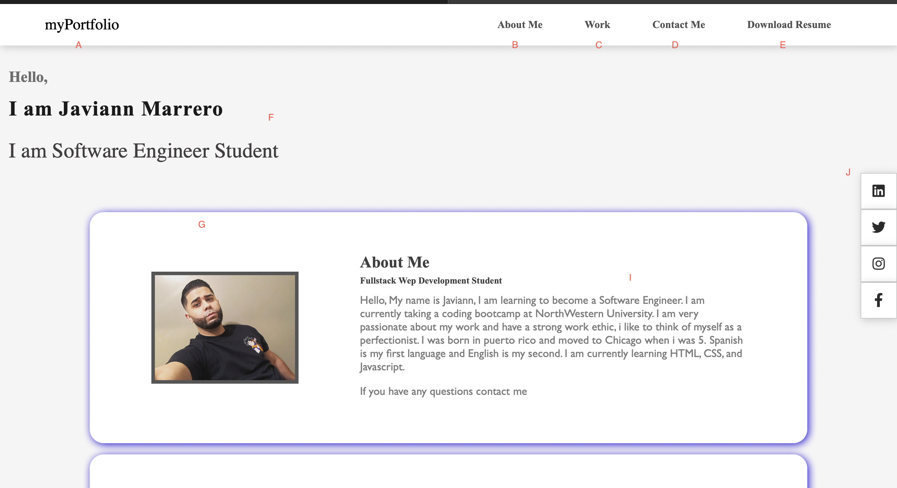
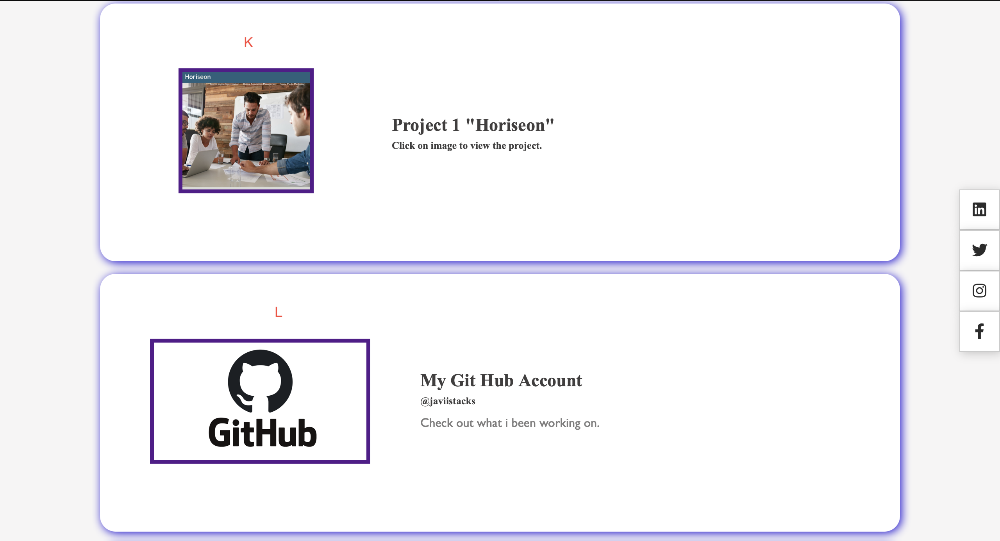
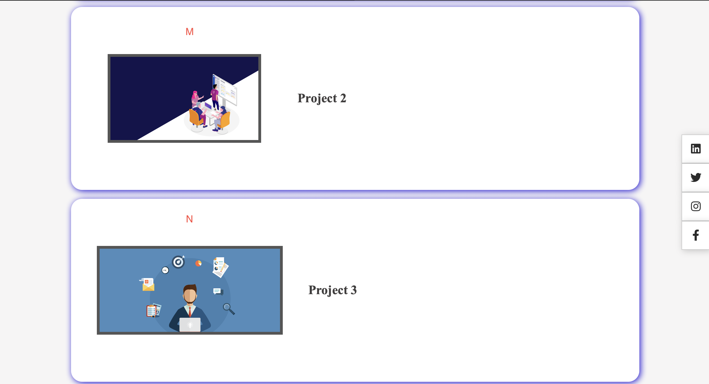
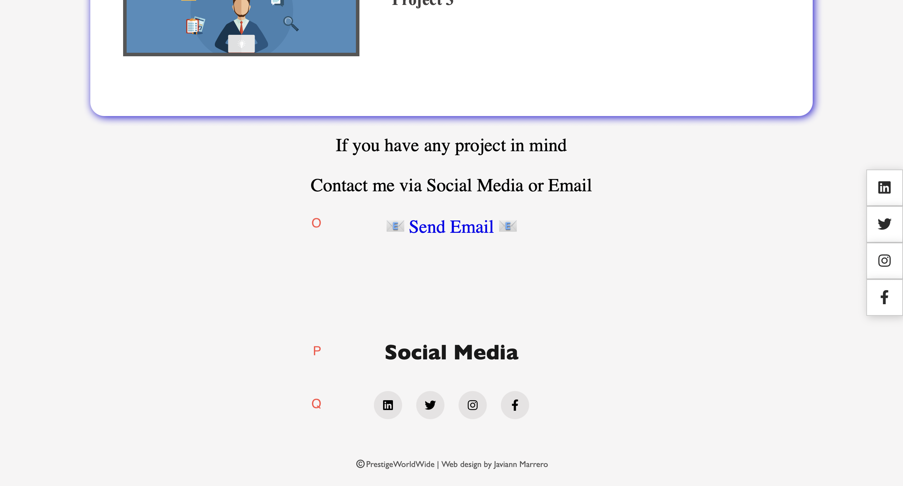
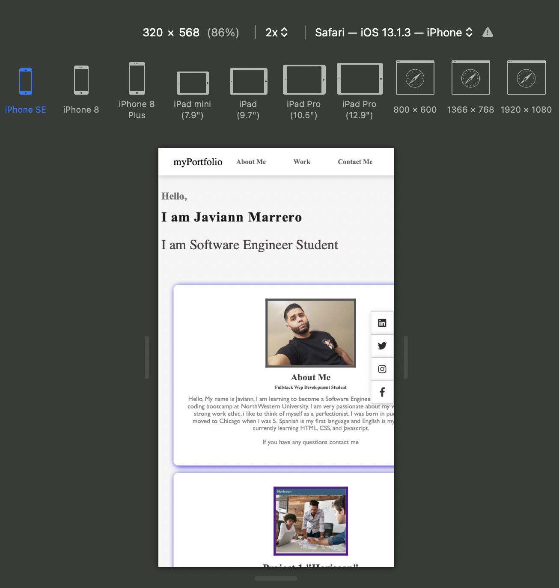

#HOMEOWORK 2 Portfolio

myPortfolio

A. In the nav bar is a hyperlink when user click on "myPortfolio" it will direct user back to website.

B. In the nav bar is a hyperlink when user click on "About Me" it will direct user to about me section on website.

C. In the nav bar is a hyperlink when user click on "Work" it will direct user to work section on website.

D. In the nav bar is a hyperlink when user click on "Contact Me" it will direct user to bottom of page where they can contact me via email and social media.

E. In the nav bar is a hyperlink when user click on "Download Resume" it will ask user if they want to download my Resume and file will be downloaded and saved on user computer.

F. This section is my sub heading in which i formally introduce myself to user.

G. I made float box's for about me and work sections, this will help user visually see what they are looking for. Picture in all float boxes have opacity when user moves mouse over picture.

I. Text and image will change according to user media screen. All images have alt attributes.

J. Easy access to social media platforms that hovers on screen. Icons will direct user to my social media accounts in new webpage. Icons will interact when user hovers mouse over social media icon.

K. When user clicks on picture it will direct them to completed project in my github account. 

L. When user clicks on picture it will direct them to my GitHub account in new a webpage.

M. Extra picture for upcoming projects.

N. Extra picture for upcoming projects.

O. When user clicks on blue "Send Email" hyperlink it will navigate user to compose an email to me.

P. Social Media footer.

Q. All "Social Media" icons are working and will navigate user to my social media accounts on platforms Linkedin, Twitter, Instagram, and Facebook. Icons will interact when user hovers mouse over social media icon.

I made website responsive to fit in an iphone 8 and iphone SE media screen.

My Git hub profile : https://github.com/javiistacks
Finished Product: https://javiistacks.github.io/myPortfolio/

## License

Copyright (c) Javiann Marerro. All rights reserved. 
Please be kind and change content if you wish to use this code.

Licensed under the MIT License

Copyright (c) 2021 - present | Javiann Marerro

<blockquote>
Permission is hereby granted, free of charge, to any person obtaining a copy
of this software and associated documentation files (the "Software"), to deal
in the Software without restriction, including without limitation the rights
to use, copy, modify, merge, publish, distribute, sublicense, and/or sell
copies of the Software, and to permit persons to whom the Software is
furnished to do so, subject to the following conditions:

The above copyright notice and this permission notice shall be included in all
copies or substantial portions of the Software.

THE SOFTWARE IS PROVIDED "AS IS", WITHOUT WARRANTY OF ANY KIND, EXPRESS OR
IMPLIED, INCLUDING BUT NOT LIMITED TO THE WARRANTIES OF MERCHANTABILITY,
FITNESS FOR A PARTICULAR PURPOSE AND NONINFRINGEMENT. IN NO EVENT SHALL THE
AUTHORS OR COPYRIGHT HOLDERS BE LIABLE FOR ANY CLAIM, DAMAGES OR OTHER
LIABILITY, WHETHER IN AN ACTION OF CONTRACT, TORT OR OTHERWISE, ARISING FROM,
OUT OF OR IN CONNECTION WITH THE SOFTWARE OR THE USE OR OTHER DEALINGS IN THE
SOFTWARE.
</blockquote>

